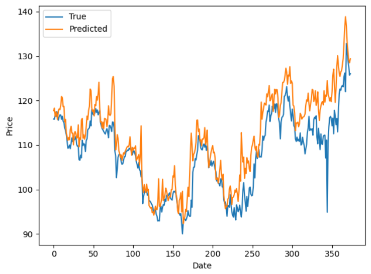

# Stock-Price-Prediction-model
Using data from **stock_dataset.csv**, 70 percent as training and 30 percent as testing      
Using the past three days **Open**, **High**, and **Low** prices and **Volume** as feature, using next day's **Open** price as label     
The architecture of the model:    
LSTM(units=100)   
Dense(units=20, activation='relu')   
Dense(units=1, activation='linear')     # Regression problem    

Folder structure:   
* data   
  * q2_dataset.csv   
  * test_data_RNN.csv   
  * train_data_RNN.csv   
* models   
  * saved model   
* test_RNN.py   
* train_RNN.py

The predicting results show as below

